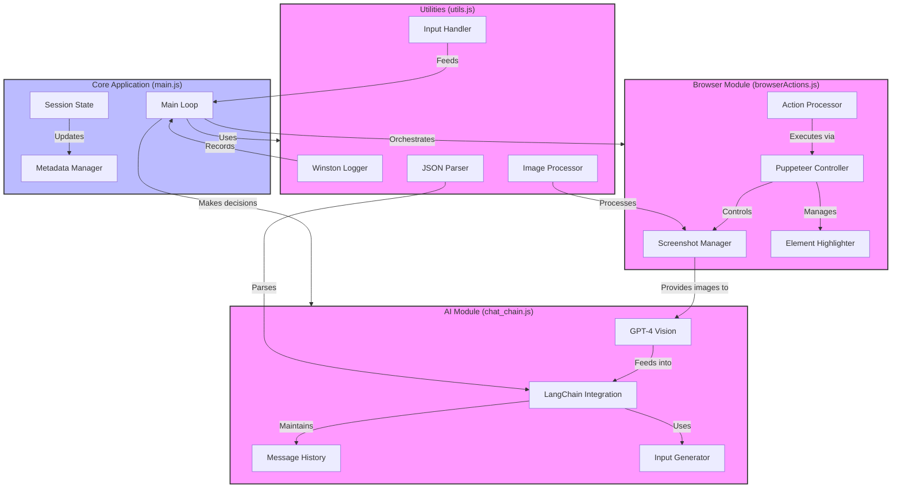

# Vision Brower Control

An AI-powered web automation tool that combines GPT-4 Vision with Puppeteer to create an intelligent browsing system.
The system can understand web pages visually, interact with elements, and execute complex sequences of actions to
achieve specified goals.

## Features

- 🔍 **Visual Understanding**: Uses GPT-4 Vision to analyze webpage screenshots
- 🎯 **Goal-Oriented Navigation**: Executes multi-step actions to achieve user-defined objectives
- 🤖 **Intelligent Form Filling**: Automatically generates contextually appropriate form inputs
- 🔄 **Dynamic Content Handling**: Adapts to page changes and state transitions
- 🎨 **Element Highlighting**: Visually marks interactive elements for precise interaction

## Architecture



## Setup

1. Install dependencies:

```bash
npm install
```

2. Create `.env` file:

```env
OPENAI_API_KEY=your_api_key_here
```

3. Run the application:

```bash
node main.js
```

## Example Usage

```bash
$ node main.js
Enter the initial URL to start browsing: https://example.com
Enter your main goal: Login to linkedIn and apply to jobs with easy apply available
```

The system will:

1. Load the specified URL
2. Analyze the page visually
3. Plan and execute actions to achieve the goal
4. Provide progress updates

## Implementation Details

### Visual Analysis

- Screenshots page content
- Identifies interactive elements
- Understands page layout and structure

### Action Planning

- Determines optimal action sequences
- Handles navigation decisions
- Manages form interactions

### State Management

- Tracks browsing session progress
- Maintains action history
- Monitors goal completion

## Requirements

- Node.js 16+
- OpenAI API key
- Chrome/Chromium browser

## Limitations

- Requires stable internet connection
- Performance varies with page complexity
- May need adjustments for specific websites

## License

MIT
